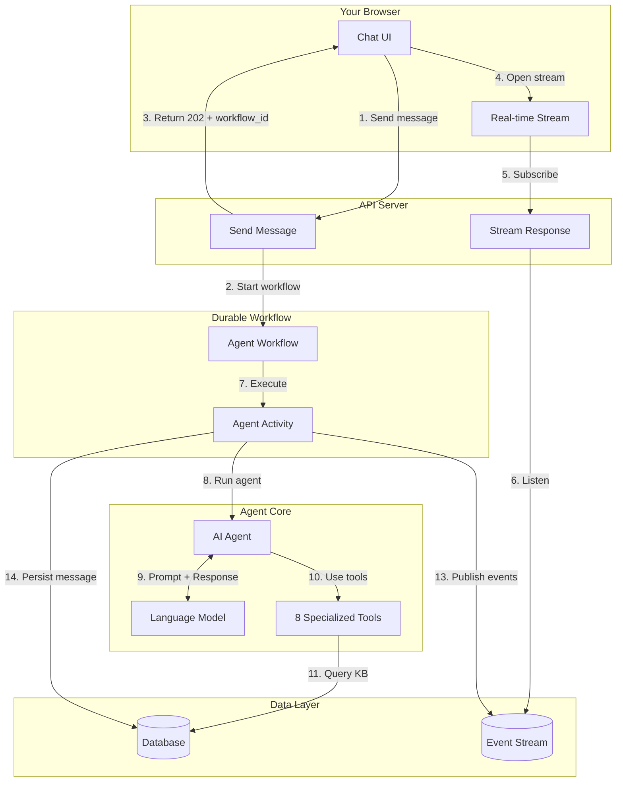

# AI Agent

The Knowledge Stack agent is an AI-powered conversational assistant that can search, browse, read, and reason over your organization's knowledge base. It has access to your documents, sections, and chunks through a set of specialized tools.

When you send a message in a chat thread, the agent:

1. Receives your message
2. Decides which tools to use (search, read, browse, etc.)
3. Calls those tools to retrieve information from your knowledge base
4. Synthesizes a response with inline citations linking back to specific content
5. Streams the response in real-time to your browser

The agent is **not** a simple RAG (Retrieval-Augmented Generation) pipeline. It is an **agentic loop** -- the LLM autonomously decides what to do next, can make multiple tool calls, reason about results, and iterate until it has enough information to answer.

---

## How It Works



### Two-Phase Pattern

The key architectural insight is the **two-phase pattern**:

- **Phase 1 (steps 1-6):** The API immediately returns `202 Accepted` and your browser opens a streaming connection. This is non-blocking -- you see a "thinking" indicator immediately.
- **Phase 2 (steps 7-14):** The agent runs asynchronously. As it thinks, searches, and writes, events are published in real-time to your browser.

---

## Request Lifecycle

Here is the complete flow from sending a message to receiving a response:

1. **You send a message** -- the API creates a record of your message and starts a durable workflow
2. **Your browser opens a stream** -- a Server-Sent Events (SSE) connection receives real-time updates
3. **The agent processes your request:**
   - Fetches your conversation history for context
   - Decides which tools to use (search, read, browse, etc.)
   - Calls tools to retrieve information from your knowledge base
   - May call multiple tools iteratively until it has enough information
   - Generates a response with inline citations
4. **You see the response stream** -- text appears token-by-token, with tool calls visible as thinking steps
5. **The response is saved** -- the complete message with citations is persisted to the database
6. **The stream closes** -- your browser receives a completion signal

If your connection drops during streaming, you can reconnect and either resume the stream or fetch the completed message.

---

## Agent Capabilities

### Tools

The agent has 8 specialized tools for interacting with your knowledge base:

| Tool | Purpose |
|------|---------|
| `search_knowledge` | Semantic search -- find content by meaning |
| `search_keyword` | Keyword search -- find exact terms, IDs, error codes |
| `read` | Read documents, sections, or chunks with smart content sizing |
| `read_around` | Expand context around a search result |
| `list_contents` | Browse folder contents |
| `find` | Search for folders or documents by name |
| `get_info` | Get metadata and breadcrumb for any node |
| `view_chunk_image` | View the original image for visual chunks |

See the [Tools](/agent/tools) page for detailed documentation on each tool.

### Citations

Every fact the agent states from your knowledge base is backed by a citation linking to the specific chunk of content. The agent writes responses with inline markers that are resolved into structured citation objects with source paths and quotes.

Multiple citation formats are supported:
- `[chunk_id]` -- standard format
- `[chunk_id1, chunk_id2]` -- multiple citations
- Other formats are normalized automatically

### Conversation History

The agent maintains conversation context across messages in a thread. It loads your recent message history (up to 10 messages) and uses it to understand follow-up questions and maintain context.

### Real-Time Streaming

As the agent works, you see:

| Event | What You See |
|-------|-------------|
| Text tokens | Response text appearing word-by-word |
| Tool calls | Which tool the agent is using and why |
| Tool results | Summary of what the tool found |
| Thinking | The agent's reasoning process (when supported by the model) |
| Citations | Links to source content |

---

## Reliability

### Error Handling

Errors are handled gracefully across three categories:

| Category | Handling | What You See |
|----------|----------|-------------|
| Input errors | Fails immediately, no retry | Error notification |
| LLM provider issues | Automatic retry | Brief delay, then response |
| Unexpected errors | Error message persisted | "Something went wrong" message in thread |

### Always-Persist Guarantee

No matter what goes wrong, the agent always persists a response to the thread. Even if the LLM completely fails, you see a "Something went wrong. Please try again." message rather than the UI getting stuck in a loading state.

### Concurrent Run Protection

Only one agent run can be active per thread at a time. If you send a message while the agent is already processing, you receive a `409 Conflict` response.

---

## Configuration

### Agent Behavior

| Setting | Default | Description |
|---------|---------|-------------|
| Tool call limit | 20 | Maximum tool calls per run |
| Model request limit | 50 | Maximum LLM requests per run |
| History depth | 10 | Messages loaded for conversation context |
| Search result limit | 20 | Maximum search results per query |
| Auto-expand budget | 2,000 tokens | Documents smaller than this are returned inline |

### Streaming Events

The streaming protocol follows an industry-standard pattern:

| Event | When |
|-------|------|
| `message_start` | Agent begins processing |
| `text_start` / `text_delta` / `text_end` | Response text is being generated |
| `step` | Tool call or result |
| `reasoning_start` / `reasoning_delta` / `reasoning_end` | Agent thinking (model-dependent) |
| `citations` | Final citation data |
| `message_end` | Agent finished |
| `done` | Stream complete |

---

## API Endpoints

### Send a message

```
POST /v1/threads/{thread_id}/user_message
```

Sends your message and triggers agent processing. Returns `202 Accepted` immediately with a `workflow_id`.

**Request:**
```json
{
  "input_text": "What is the retention policy?"
}
```

**Response (202):**
```json
{
  "workflow_id": "agent-{thread_id}"
}
```

### Stream the response

```
GET /v1/threads/{thread_id}/stream
```

Opens an SSE connection to receive real-time agent output.

**Query parameters:**

| Param | Type | Description |
|-------|------|-------------|
| `last_message_id` | UUID (optional) | Message ID to resume from |
| `last_entry_id` | string (optional) | Stream entry ID to resume from |

If you provide `last_message_id`, you must also provide `last_entry_id`. If the message is no longer streaming when you reconnect, you receive a `message_not_streaming` event and can fetch the completed message via REST.

---

## Glossary

| Term | Definition |
|------|-----------|
| **Agent** | An LLM that autonomously decides which tools to use to accomplish a task |
| **Chunk** | The smallest unit of content in the knowledge base (a paragraph, image, table, etc.) |
| **Citation** | A link from the agent's response to a specific chunk in your knowledge base |
| **SSE** | Server-Sent Events -- a protocol for one-way server-to-client streaming over HTTP |
| **Tool Budget** | A limit on how many tool calls the agent can make per run (default: 20) |
