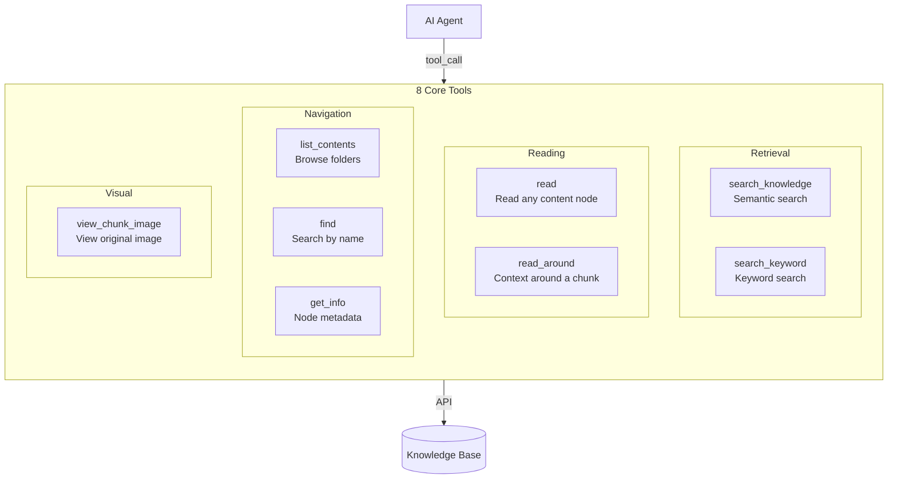

# Agent Tools

Tools are the agent's interface to your knowledge base. The AI agent decides which tools to call and with what arguments to answer your questions.

---

## Design Principles

1. **Universal identifiers** -- every tool returns `path_part_id` values, and every tool accepts them, giving the agent a consistent way to navigate your content
2. **One tool per intent** -- no two tools serve the same purpose
3. **Smart dispatch** -- the tool figures out the content type automatically, so the agent does not need to
4. **Minimize round-trips** -- common workflows complete in 1-2 tool calls
5. **File system intuition** -- tools map to familiar concepts: browse, find, read, search
6. **Automatic sizing** -- tools use content statistics to decide whether to return content inline or as a paginated listing, so the agent never has to reason about content size

---

## Tool Overview

---

## Tool Budget

To prevent runaway loops, every tool call counts against a budget:

- **Default limit:** 20 tool calls per run
- **Warning threshold:** When 4 calls remain, the tool tells the agent to wrap up soon
- **Hard stop:** At 0 remaining, the agent is told to synthesize its response now

This ensures the agent produces an answer within a reasonable number of steps.

---

## Tool Reference

### 1. `list_contents` -- Browse Folders

List the contents of a folder. Pass `null` to list root-level folders.

| Parameter | Type | Default | Description |
|-----------|------|---------|-------------|
| `path_part_id` | UUID or null | null | Folder to list. Omit for root folders. |
| `limit` | int | 20 | Results per page (1-100) |
| `offset` | int | 0 | Pagination offset |

**Behavior:**
- If `path_part_id` is null, lists root folders
- If `path_part_id` is a folder, lists its children (folders and documents)
- If `path_part_id` is a document or section, returns an error directing the agent to use `read` instead

**Returns:** List of child items with pagination info.

---

### 2. `find` -- Search by Name

Search across your entire knowledge base by name. Use this when you know the name (or part of the name) of what you are looking for.

| Parameter | Type | Default | Description |
|-----------|------|---------|-------------|
| `name` | string | *required* | Substring to match (case-insensitive) |
| `kind` | string or null | null | Filter by `"FOLDER"` or `"DOCUMENT"` |
| `limit` | int | 20 | Results per page (1-100) |
| `offset` | int | 0 | Pagination offset |

**Returns:** Matching items with pagination info.

---

### 3. `get_info` -- Inspect Any Node

Get metadata and a breadcrumb trail for any node in the knowledge base. This is the "where am I?" tool.

| Parameter | Type | Default | Description |
|-----------|------|---------|-------------|
| `path_part_id` | UUID | *required* | Node to inspect |

**Returns:** Node type, name, full path, and a breadcrumb list from root to the node (e.g., `shared > reports > Q4 Analysis`).

---

### 4. `read` -- Adaptive Content Reader

Read any node in the knowledge base. The tool automatically adapts its response based on the content size:

| Parameter | Type | Default | Description |
|-----------|------|---------|-------------|
| `path_part_id` | UUID | *required* | Node to read |
| `limit` | int | 20 | Chunks per page for large content (1-100) |
| `offset` | int | 0 | Chunk offset for pagination |

**Behavior by node type:**

| Node Type | Small Content | Large Content |
|-----------|--------------|---------------|
| Document | All chunks returned inline | Table of contents with per-section statistics |
| Section | All chunks returned inline | Paginated chunks with limit/offset |
| Chunk | Single chunk content returned | -- |

**How "small" vs "large" is determined:** The tool checks the total token count of the content against an internal budget (default: 2,000 tokens). If the content fits, everything is returned in one call. If not, the tool returns a navigable structure with statistics to guide further reads.

This means the agent gets optimal responses without needing to reason about content size -- small documents are fully readable in one call, while large documents get a structured overview.

---

### 5. `read_around` -- Context Expansion

Expand the reading window around a search result. After finding a relevant chunk via search, use this to see the surrounding context.

| Parameter | Type | Default | Description |
|-----------|------|---------|-------------|
| `chunk_id` | UUID | *required* | The chunk to expand around |
| `window` | int | 1 | Chunks before AND after (1-10) |

**Smart section expansion:** If the chunk's parent section is small enough (within the token budget), the tool returns the entire section instead of just the window. This means a single `read_around` call often gives you the complete context.

**Returns:** The anchor chunk, surrounding chunks, the anchor's position in the list, and whether the full section was returned.

---

### 6. `search_knowledge` -- Semantic Search

Search your knowledge base by meaning using dense vector search. Best for concepts, explanations, and natural-language questions.

| Parameter | Type | Default | Description |
|-----------|------|---------|-------------|
| `query` | string | *required* | Natural-language question or topic |
| `top_k` | int | 5 | Maximum results (1-20) |
| `parent_path_part_ids` | list of UUIDs or null | null | Scope search to specific folders or documents |

**Examples of when to use this:**
- "How does authentication work?"
- "What is the data retention policy?"
- "Explain the onboarding process"

**Returns:** Matching chunks with content, relevance score, chunk type, and location path.

---

### 7. `search_keyword` -- Keyword Search

Search your knowledge base for exact terms using BM25 full-text search. Best for specific identifiers, error codes, filenames, and configuration values.

| Parameter | Type | Default | Description |
|-----------|------|---------|-------------|
| `query` | string | *required* | Keywords or phrases |
| `top_k` | int | 5 | Maximum results (1-20) |
| `parent_path_part_ids` | list of UUIDs or null | null | Scope search to specific folders or documents |

**Examples of when to use this:**
- "Find references to ERROR-4021"
- "Where is config.yaml mentioned?"
- "Search for RETENTION_DAYS"

**Returns:** Same format as `search_knowledge`.

### When to Use Which Search

| Search Tool | Method | Best For |
|-------------|--------|----------|
| `search_knowledge` | Semantic (dense vectors) | Concepts, explanations, "How does X work?" |
| `search_keyword` | Keyword (BM25 full-text) | Exact tokens: IDs, error codes, filenames, config values |

---

### 8. `view_chunk_image` -- View Visual Asset

Fetch the original image for a chunk that has a visual asset (image or table screenshot).

| Parameter | Type | Default | Description |
|-----------|------|---------|-------------|
| `chunk_id` | UUID | *required* | Chunk whose image to view |

**Returns:** The image binary and a text description.

---

## Common Workflows

Here is how common tasks map to tool calls:

| Task | Tool Calls |
|------|-----------|
| Browse root folders | `list_contents()` (1 call) |
| Find and browse a folder | `find("reports")` -> `list_contents(id)` (2 calls) |
| Read a small document | `find("policy")` -> `read(id)` (2 calls, content inline) |
| Read a large document | `find("manual")` -> `read(id)` (TOC) -> `read(section_id)` (3 calls) |
| Search and expand context | `search_knowledge("auth")` -> `read_around(chunk_id)` (2 calls) |
| Get location context | `get_info(path_part_id)` (1 call) |
| Navigate up from a result | `get_info(id)` -> `list_contents(parent_id)` (2 calls) |

---

## Automatic Content Sizing

A central design principle: **the tool, not the agent, decides how much content to return**.

LLMs are not good at reasoning about token budgets. If you tell an agent "this section has 12,000 tokens", it does not know whether that fits in context. By handling this internally:

- **Small content** (within budget): The agent gets everything in one call -- no pagination overhead
- **Large documents** (over budget): The agent gets a section-level table of contents with per-section statistics, letting it pick which sections to read
- **Large sections** (over budget): The agent gets paginated chunks
- **Missing statistics** (content not yet fully processed): Safe fallback to paginated mode
