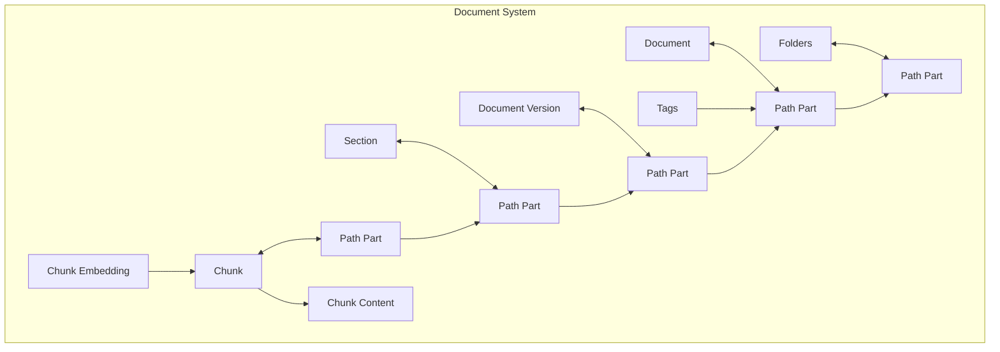

# Path System

Knowledge Stack organizes all content using a Unix-inspired path system. Just like files on your computer live at paths like `/home/docs/report.pdf`, every resource in Knowledge Stack has a path.

## Why paths?

Paths give you a familiar, intuitive way to organize and navigate your knowledge base:

- **Nested folders** — Create any folder structure that fits your workflow.
- **Path-based permissions** — Grant access to entire subtrees with a single rule (e.g., "read access to `/shared/engineering`").
- **Traversable hierarchy** — Navigate from a document down to its versions, sections, and individual chunks.
- **Stable references** — Resources maintain consistent paths even as the tree grows.

## How it works

Every resource in Knowledge Stack — folders, documents, versions, sections, and chunks — is a **path part**. Path parts link together to form a tree:



For example, a document's path might look like:

```
/shared/engineering/design-doc/v1/introduction/chunk-001
 └─folder─┘ └─folder─┘ └─document─┘ └ver┘ └─section──┘ └─chunk──┘
```

## Resource types

| Type | Description | Example path |
|------|-------------|-------------|
| **Folder** | Container for organizing documents and subfolders | `/shared/engineering` |
| **Document** | A document container | `/shared/engineering/design-doc` |
| **Document Version** | A specific version of a document | `/shared/engineering/design-doc/v1` |
| **Section** | A heading or section within a version | `/shared/engineering/design-doc/v1/introduction` |
| **Chunk** | A piece of content (text, table, or image) within a section | `/shared/engineering/design-doc/v1/introduction/chunk-001` |
| **Thread** | A conversation thread | `/users/alice/threads/my-thread` |
| **Thread Message** | A message within a thread | `/users/alice/threads/my-thread/1` |

## Documents in depth

### Versions

Every document can have multiple versions. When you upload a new version, the previous versions remain accessible. The document tracks which version is currently active.

### Sections

Sections represent the structure within a document version — headings, chapters, subsections. Sections can nest inside each other, mirroring the document's original outline.

### Chunks

Chunks are the smallest units of content. Each chunk contains a piece of text, a table, or an image extracted from the document. Chunks are what get embedded and returned in search results.

Chunk types:
- **TEXT** — A paragraph or block of text
- **TABLE** — A structured table (with an optional AI-generated summary)
- **IMAGE** — An extracted image with bounding box metadata

### Content deduplication

Chunk content is stored using a content-addressable system. If two chunks have identical text, the content is stored only once. When you edit a chunk's content, the system automatically handles deduplication — creating new content records only when needed.

## Tags

Tags let you label and categorize path parts. A tag has a name, an optional description, and a color. Tags are associated with path parts through a many-to-many relationship, so you can attach multiple tags to any folder, document, or section.

## Materialized paths

Each path part stores its full path from root to leaf (e.g., `/shared/engineering/design-doc`). This enables:

- **Fast lookups** — Find any resource by its full path without traversing the tree.
- **Subtree queries** — Efficiently find all resources under a given path.
- **Permission checks** — Quickly determine if a user has access to a resource by comparing paths.

Paths are automatically maintained — when you rename or move a resource, all descendant paths update accordingly.

## Ordering

Siblings within a folder maintain a stable order. You can rearrange items, and the ordering is preserved consistently across API calls.

## Cascading deletes

When you delete a folder or document, all of its children are automatically cleaned up. Deleting a folder removes all documents, versions, sections, and chunks within it. This ensures your knowledge base stays consistent without orphaned resources.
